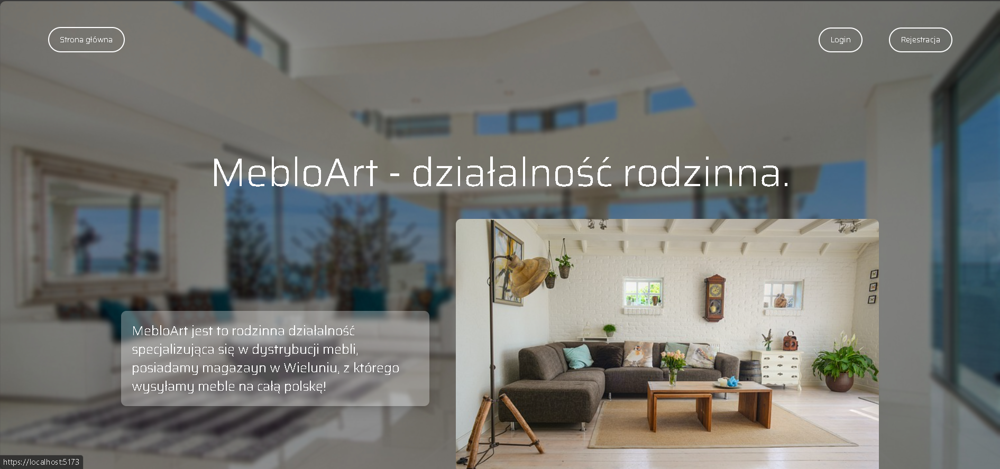

# MebloArt

MebloArt is a modern furniture catalog/shop application built with C#, .NET 8.0, and integrated with Azure services. The front-end is developed using ReactJS, TypeScript, and Vite, creating a dynamic user experience.



## Features

- Full-stack application with ReactJS front-end and C# backend.
- Utilizes Azure Blob Storage for scalable image hosting.
- Integrated Identity package for authentication.
- RESTful API documentation with Swagger.
- Deployment on Azure for high availability and performance.

## Prerequisites

Before you begin, ensure you have the following installed:
- .NET 8.0 SDK
- Node.js and npm
- An Azure account with Blob Storage and an SQL database

## Getting Started

To get a local copy up and running, follow these simple steps:

1. Clone the repository:
```bash
git clone https://your-repository-url
cd Meble
```
2. Install NPM packages
```bash
cd Meble.client
npm install
```
3. Restore .NET packages for the backend:
```bash
cd ../Meble.Server
dotnet restore
```
4. Update the appsettings.json file with your connection strings and other configurations as follows:
  ```json
   {
  "Logging": {
    "LogLevel": {
      "Default": "Information",
      "Microsoft": "Warning",
      "Microsoft.Hosting.Lifetime": "Information"
    }
  },

  "ConnectionStrings": {
    "ConnectionString": "your_connection_string_here",
    "HealthTestConnectionString": "your_connection_string_here",
    "DefaultConnection": "your_connection_string_here"
  },

  "AzureBlobStorage": {
    "ConnectionString": "your_azure_blob_storage_connection_string",
    "ContainerName": "meble"
  },

  "AllowedHosts": "*"
}
```
5. Run the backend server:
```bash
dotnet run
```
6. Start the frontend application:
```bash
npm start
```

### Important Note
Ensure to populate your Azure Blob Storage and SQL database with the necessary data as these are hosted on the cloud and need proper configuration.
### Contributing
Contributions are what make the open-source community such an amazing place to learn, inspire, and create. Any contributions you make are greatly appreciated.

## Important Note V2

Before running the application, it is essential to apply database migrations to ensure the database schema is up-to-date with the current application model. You can perform migrations using the following steps:

**Run the migration command**
- In the Package Manager Console, type:
```bash
Update-Database
```
- This command will apply the latest migrations to your database as defined in the Entity Framework configuration.

Failure to perform these migrations may result in runtime errors due to schema mismatches between the application and the database.
